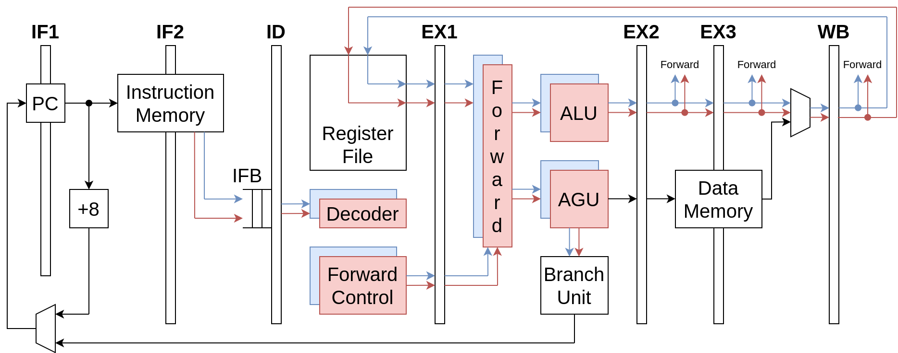

# Super RISC-V Processor

This repository contains the master's thesis focusing on the development of a superscalar RISC-V processor written in SystemVerilog hardware description language. The repository contains the source code files and the thesis text is available on [the university website](https://www.vut.cz/en/students/final-thesis/detail/155087).



The created processor is called "Super RISC-V" to highlight its superscalar capabilities. It adopts the RISC-V instruction set, of which it supports the base integer instructions, collectively labeled as RV32I. The processor can be characterized by the following distinctive features:

* 7-stage pipeline architecture
* In-order instruction execution
* Dual-issue pipeline design
* Deterministic issue slots of instructions
* Two-stage forwarding control
* Power-aware write enable signals
* Paths optimized for maximal frequency
* Partial support of AMBA3 AHB-Lite protocol

## Repository Structure

* `measured` - processor performance data
* `specs` - related specifications
* `src` - source code files root
* `README.md` - this file
* `super-riscv-pipeline.png` - processor pipeline diagram

### Source Code Structure

* `src/out` - generated files (created when required)
* `src/rtl` - processor design files
* `src/tb` - base used for processor testing
* `src/tests` - individual tests
* `src/utils` - other useful files
* `src/LICENSE` - license for source code files
* `src/Makefile` - entry point for user commands
* `src/run_tests.sh` - automated test runner

## Processor Simulation

To see how the processor works, the easiest way is to get the processor under simulation. Since even that process might be exhausting, a custom build system has been created during the processor development. This significantly saves time for users as they typically need to enter only one command, the build system will do the rest.

> Even though the processor is only simulated here, keep in mind that its SystemVerilog description inherently allows targetting an FPGA or even manufacturing it as a chip.

### Simulation Requirements

All that is needed to bring the Super RISC-V processor to life is stated here:

* [Make](https://www.gnu.org/software/make/)
* [Verilator](https://www.veripool.org/verilator/)
* [GCC](https://gcc.gnu.org/)

Optionally:

* [RISC-V GCC](https://github.com/riscv-collab/riscv-gnu-toolchain) for RISC-V programs compilation
* [GTKWave](https://gtkwave.sourceforge.net/) for displaying signal traces

> All listed tools are available for the reference system, Ubuntu 22.04:
>
> * `sudo apt install make verilator gcc gtkwave`
> * RISC-V GCC might be obtained precompiled for Ubuntu 22.04 from [its GitHub releases](https://github.com/riscv-collab/riscv-gnu-toolchain/releases) and added to `PATH` manually
>   * For testing, `riscv32-elf-ubuntu-22.04-gcc-nightly-2024.03.01-nightly.tar.gz` was used

### How to Run Simulation

First, open a terminal emulator in the `src` directory, where a `Makefile` is located. Then run `make hello_world`, which translates the SystemVerilog (SV) processor description into a C++ model, compiles the C++ model, and runs a processor simulation with a precompiled "Hello World" program loaded in the processor's memory. All generated files can be found in the `out` directory. This is a convenient way of testing that the build system works. Among others, the output should include something like this:

```
./out/build/Vtb +verilator+noassert +verilator+rand+reset+0 +test+path=utils/hello_world.hex
 ----------------------------------------------- 
|                                               |
|   Hello World, I am Super RISC-V processor!   |
|                                               |
 ----------------------------------------------- 
- tb/tb.sv:156: Verilog $finish
Simulated cycles: 1524
Executed instructions: 1260
```

Since the build system uses Make, it was designed so that if some dependencies are missing, they are automatically built/rebuilt if needed (e.g., running a simulation requires building a C++ model first). However, the `Makefile` also contains targets for individual steps:

* `make`/`make verilate` - translate the SV processor description into a C++ model
* `make build` - compile the C++ model into an executable processor simulator
* `make sim` - compile a RISC-V program and run processor simulation with it
* `make debug` - run processor simulation with a RISC-V program and create files for processor debugging
* `make waves` - run processor simulation with a RISC-V program and display signal waves
* `make clean` - clean all generated files

> Note that `sim`, `debug`, and `waves` targets compile a RISC-V program before running the simulation. They use RISC-V GCC for that and it must be installed on the system before running those targets.

The `Makefile` also accepts the following macros to adjust its behavior:

* `ASSERTS=1` - enable SV assertions
* `MAX_CYCLES=<value>` - max cycles of simulation
* `TEST_NAME=<name>` - test to be run on the CPU
* `WAVES_FILE=<path>` - path of output signal waves file
* `X_VAL=0|1|2` - unknown values in SV are replaced with: 0 - zeros, 1 - ones, 2 - random values
* `SEED=<value>` - seed used for any randomized event

An interesting macro that deserves more attention is `TEST_NAME`, which defines what RISC-V program is compiled and run by the processor during the simulation. The list of possible test names includes file names present in the `tests` directory without their `.s` file extensions. It is possible to create a new RISC-V program easily by adding it here. The default test name is `hello_world`.

#### Examples of Running Simulation

Run the `fib_seq.s` test with processor asserts enabled:
  
* `make sim ASSERTS=1 TEST_NAME=fib_seq`

Display waves of the `hello_world.s` test in GTKWave:

* `make waves`

Generate debug files (disassembly and waves files) when running `hazards.s`:

* `make debug TEST_NAME=hazards`

Run bubble sort test optimized for Super RISC-V and limit cycle count:

* `make sim TEST_NAME=bubble_sort_fast MAX_CYCLES=7500`

Let a test fail due to constraining its cycle count:

* `make sim TEST_NAME=all_inst MAX_CYCLES=20`

> Note that it is normal for Verilator to use an abort signal when the simulation ends with an error code.

### Automated Testing

Since the created `Makefile` is targetted mainly for direct use by users, an automated way of processor testing was also required. The `run_tests.sh` shell script does exactly that. It uses already-existing targets of the `Makefile` to support its reuse.

To use the test runner, first, change the directory to `src` (if not already done). Then execute `./run_tests.sh`. It automatically builds the C++ processor model, collects tests from the `tests` directory, and runs them appropriately. The main report is printed directly to the terminal, all output can be found in a generated log file.
